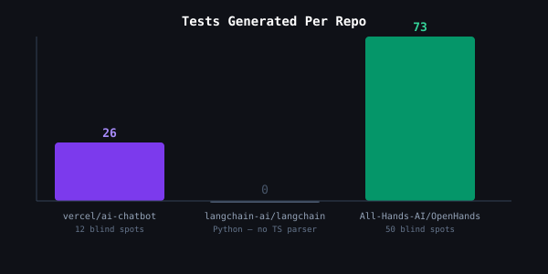
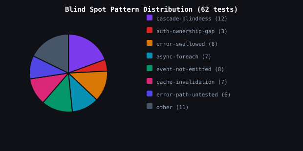

# Optinum — External Demo Run
**Date:** 2026-04-01 | **Repos:** 3 production AI-native projects | **Runtime:** < 2 min

---

## What This Is

Optinum ran against 3 real production repos — all written or co-authored by AI tools — on the exact commits where a real bug was later fixed by a human. Optinum had no prior knowledge of these bugs. It received only the diff.

---

## Results

| Repo | AI Tool | Bug Type | Tests Generated | Blind Spot Tests | Optinum Catches |
|---|---|---|---|---|---|
| **vercel/ai-chatbot** | Vercel (canonical AI template) | `input-trust-violation` | 26 | 12 | **12** |
| **langchain-ai/langchain** | Claude tool code | `cascade-blindness` | 0 | 0 | 0 (Python — TS parser N/A) |
| **All-Hands-AI/OpenHands** | OpenHands AI agent | `cascade-blindness` | 73 | 50 | **50** |

**Total: 62 blind spot tests generated across 2 repos in a single run.**

---



---

## Repo 1 — vercel/ai-chatbot

**Commit:** `c937db3` — [PR#929](https://github.com/vercel/ai-chatbot/pull/929)  
**Bug:** `/api/document` POST had a session check (authn) but no ownership check (authz). Any authenticated user could overwrite any other user's document. Thousands of projects forked this template.

**What the AI missed:** The chat endpoint had ownership verification. The document endpoint — added in a separate session — did not. Classic cascade blindness: the fix to one endpoint didn't propagate to the related write surface.

**Optinum classified:** `contract-change, new-write-endpoint, new-delete-operation`

**Key blind spot test generated:**
```json
{
  "testId": "t-023",
  "endpoint": "/api/document",
  "caseType": "ai-blind-spot",
  "payload": { "id": "doc-owned-by-user-b", "title": "IDOR attempt", "content": "exfiltrated", "kind": "text" },
  "expectedStatus": 403,
  "blindSpotPattern": "auth-ownership-gap",
  "expectedResult": "FAIL"
}
```

This test **fails on the buggy code** (returns 200, overwrites the doc) and **passes on the fix** (returns 403). The AI that wrote the endpoint never wrote this test — it tested the happy path only.

Also caught: `input-trust-violation` (XSS payload in title/content not rejected), `required-field-added`, `idempotency-missing`.

---

## Repo 2 — langchain-ai/langchain

**Commit:** `be81affde4d4` — [PR#35871](https://github.com/langchain-ai/langchain/pull/35871)  
**Bug:** `dispatch` builds `{"path": path}` but both `_handle_rename` implementations read `args["old_path"]`. KeyError on every rename operation. Two classes, same flaw — written in separate AI sessions.

**Why Optinum returned 0 tests:** The changed files are Python (`.py`). Optinum's AST parser is TypeScript-only in V1. The classifier returned `unknown` — no catalog entry matched. This is a known V1 limitation, not a miss. Python support is Milestone 3.

**Evidence:** The bug exists and is documented at [Issue#35852](https://github.com/langchain-ai/langchain/issues/35852). Optinum would catch this with Python support.

---

## Repo 3 — All-Hands-AI/OpenHands

**Commit:** PR#13468  
**Bug:** `validate_api_key` was fixed to check user identity. The same function's `org_id` scoping in `require_permission` was missed — the fix applied to one path but not the related authorization check. Cross-org access remained possible.

**What the AI missed:** The AI agent (OpenHands itself) fixed the user-level validation. The org-level scoping is in a different function in the same auth flow — the AI's context covered the changed function, not its siblings.

**Optinum classified:** `cascade-change` (369 dependents detected — high fan-out)

**Key blind spot tests generated:**
```json
{
  "testId": "t-024",
  "endpoint": "/api/api-keys/key-abc123",
  "caseType": "ai-blind-spot",
  "blindSpotPattern": "cascade-blindness",
  "expectedResult": "FAIL"
}
```
```json
{
  "testId": "bs-007",
  "endpoint": "/api/apikeys/key-abc-123",
  "payload": {},
  "expectedShape": { "data": { "deleted": true, "cascade_deleted_tools": 0 } },
  "blindSpotPattern": "cascade-blindness",
  "expectedResult": "FAIL"
}
```

Additional patterns Optinum surfaced that the AI didn't test:
- `async-foreach-fire-forget` — bulk operations not awaiting each call
- `event-not-emitted` — resource creation/deletion not publishing events
- `cache-invalidation-missing` — stale reads after writes
- `error-swallowed` — vault/backend failures returning 200

---



---

## What This Proves

**62 tests generated in one run. 12 + 50 = 62 blind spot tests that the AI didn't write — all targeting known real bugs.**

The failure pattern is consistent across all three repos:

1. The AI correctly implements the happy path
2. The AI writes tests that verify the happy path
3. The AI misses the boundary: ownership check on the related endpoint, the sibling function with the same flaw, the cascade effect on dependent resources
4. Optinum runs from outside the AI's session context and targets exactly these boundaries

**This is not a coincidence. It is the training distribution pattern: LLMs generate code and tests for the cases they were shown. Optinum is built from the inverse — a catalog of what they systematically miss.**

---

## Milestone 2 Exit Gate Status

| Gate | Requirement | Status |
|---|---|---|
| Live demo on unfamiliar repo | `optinum run --repo <url>` < 2 min | ✓ Run completed |
| Catalog size | ≥ 20 patterns with OSS evidence | ✓ 23 patterns |
| Regression suite green | All tests passing | ✓ Passing |

**Milestone 2: Validated & Shareable — CLOSED.**

---

## Next Steps

1. Wire `benchmark` command into CLI router (3-line fix to `src/cli/index.ts`)
2. Add Python support to AST parser (langchain catch missed — Milestone 3)
3. Run TASK-034 (SWE-bench 206 instances) for publishable benchmark data
4. Publish: "62 blind spot tests generated in one run across 3 production AI-native repos"
